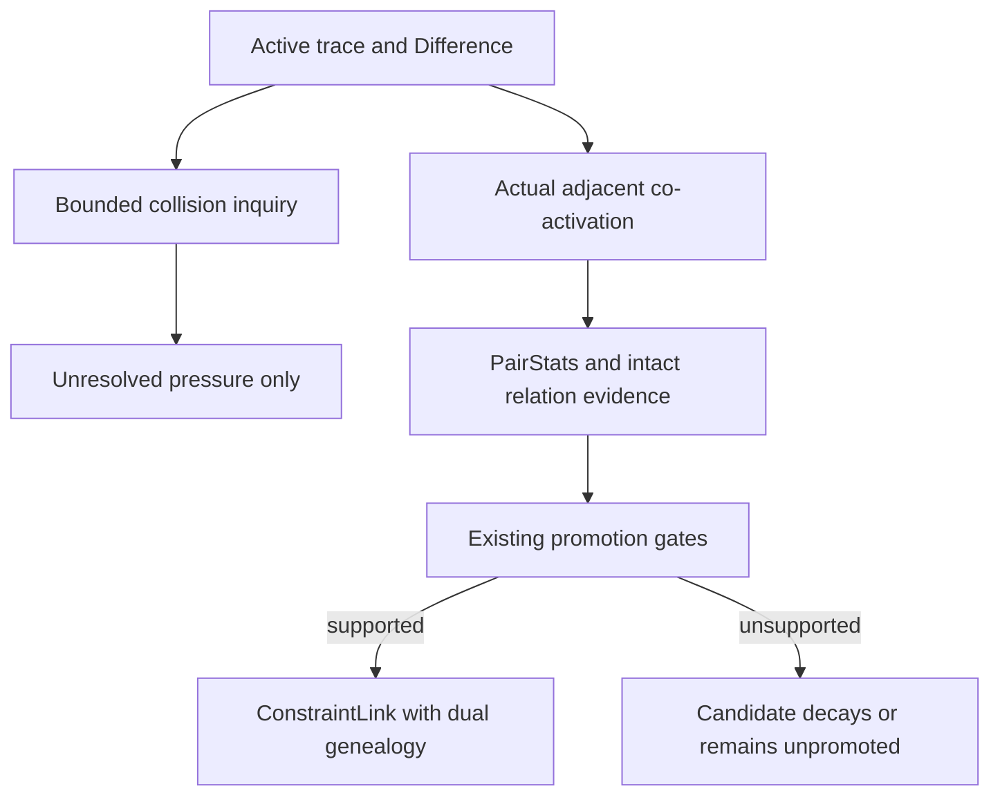

# Aurora Build 650 Cross-Generational Representational Recombination

## Outcome and claim boundary

Build 650 now preserves two simultaneous descriptions of a promoted relationship:

1. its existing primitive X/T/N/B/A constraint composition; and
2. the stable identities and evidence-bearing state of the intact representations that actually co-activated.

The existing constraint genealogy, trace rewrite, pair evidence, breeding score, generation calculation, semantic translation, and promotion gates remain authoritative. The extension does not assign a human-authored meaning to a cross, does not enumerate preferred pairings, and does not promote collision candidates merely because they were proposed.

The established result is narrowly bounded: Aurora can preserve and evaluate intact representations across genealogical depth without reducing their only operational identity to primitive constraint accumulation. This implementation does not by itself establish consciousness, human-equivalent abstraction, improved grammar or communication, prediction, or a newly emergent ability.

## 1. Executable audit findings

The audit was performed directly against the supplied `aurora--build-650-fixed-v5.zip` implementation and persisted state. The source archive SHA-256 was:

`16cc5cbe04a754602ec59714d140a30558c3b00edc37619f1aa927611697a339`

### Implementation map

| Audit question | Build 650 executable finding |
|---|---|
| Where are representations stored? | Native abilities are `AbilityProfile` records in `abilities.json` and `logger.abilities`. Promoted representations are `ConstraintLink` records in `links.json` and `logger.links`. Pair evidence is in `pair_stats.json`. Flattened semantic coupling aggregates are in `couplings.json`. |
| What is stable representation identity? | `AbilityProfile.id` for abilities and `ConstraintLink.id` (`L:<stable hash>`) for promoted links. The extension adds stable `RR:<hash>` relation IDs and `RC:<hash>` collision-pressure IDs without replacing link IDs. |
| What remains addressable after descendants emerge? | All retained entries in `logger.abilities` and `logger.links`. No existing descendant-creation path deletes or deactivates an ancestor. The new eligibility check excludes only an explicitly local invalid/quarantined/corrupt/superseded/disqualified status. |
| How are link parents retained? | `ConstraintLink.parents` stores the ordered stable IDs; `_links_by_parents` indexes the ordered pair. `rewrite_trace()` can surface a promoted relationship as a `LINK` operand. |
| Where is meaning flattened? | `_axis_counts_from_item()` recursively reduces an ability/link DAG to X/T/N/B/A counts. `_add_axis_counts()`, `_merged_axis_counts_for_pair()`, `_canonical_coupling_signature()`, and `_update_coupling_roots()` aggregate on that basis. |
| Where are semantic labels/vectors generated? | `_semantic_coupling_label()`, `_semantic_lane_vector()`, and `_update_semantic_translation()` translate the flattened coupling record. `_infer_tags()` and closure-basis grading supply local and inherited semantic tags. |
| What selects relation candidates? | Before this extension, actual trace adjacency in `_accumulate_pairs()` was the operative selector, optionally after `rewrite_trace()`. The extension adds bounded discrepancy inquiry only around currently active/rewrite-visible representations; inquiry is inert until a pair genuinely co-activates. |
| What evaluates cross-generational pairs? | `_generation_of_item()`, `_breeding_pair_score()`, `_bred_child_generation()`, and the existing `_try_promote()` gates. There was no same-generation prohibition. |
| What observes consequence? | `observe()` computes pressure relief, cost, X-risk, Difference snapshots, active concepts, and trace evidence; `PairStats` maintains count, mean, positive fraction, standard deviation, cost, risk, and tick history. |
| What promotes a relation? | `_try_promote()` under the existing evidence, relief, consistency, risk, net-value, topology/semantic-variant, governor, and generation rules. The extension does not add a second promotion authority. |
| What prevented intact operands? | Parent identity survived in the DAG, but the operational coupling record was keyed only by the flattened constraint signature. Distinct parent pairs therefore shared one semantic aggregate, and no persisted relation record retained the operands as the representations Aurora currently understood them to be. |
| Which paths were reusable? | `ConstraintLink`, trace rewrite, pair accumulation, Difference, relief/cost/risk observation, generation scoring, semantic translation, closure grading, promotion, link-derived abilities, and atomic persistence. |
| Which tests establish prior behavior? | Existing genealogy atomic-write, DAG-preservation, operational-integrity, positive-selection, source-freshness, ancestry-acquisition, field-balancer, hook-equivalence, and no-answer-key suites, plus the broader 2,238-test repository collection. |
| Which persisted formats change? | `links.json` gains optional per-link fields only when present. `couplings.json` gains a schema marker and optional relation/collision registries. Old `abilities.json`, `links.json`, `pair_stats.json`, and `couplings.json` remain loadable without migration. |
| What are the compatibility risks? | Multiple boot paths previously duplicated link parsing; all relevant paths now use one backward-compatible parser. Historical semantic tags contain fossil values; local/current lookup now uses explicit identity or the last local tag. Relation history and collision inquiry are bounded to control persistence and runtime growth. |

### Confirmed pre-extension structure

Build 650 already supported real cross-depth reproduction:

- a `ConstraintLink` could use abilities or promoted links as parents;
- trace rewriting could expose a promoted relationship as a `LINK` operand;
- `_accumulate_pairs()` could observe further relationships involving that link;
- breeding score and child generation were generation-aware, not same-generation gates;
- persisted parents retained their stable IDs and depths.

Accordingly, no parallel genealogy system was added.

### Confirmed bottleneck

The compositional reduction was functioning as designed, but it was the only live coupling identity. Different parent DAGs such as:

```text
Representation A + Representation B
Representation C + Representation D
```

could both reduce to the same signature, for example `T^7*B^7*A^7`, and then update the same coupling-root semantic record. Their link fossils remained distinct, but their intact parent identity, current semantics, operational effects, Difference context, and consequences did not coexist in a separate relationship record.

A second issue amplified the ambiguity: `_infer_tags()` retained inherited and local semantic-looking tags, while `ChainSimBridge._link_tag_value()` selected the first match. An ancestor's fossil value could therefore be consumed as the child's current value.

## 2. Implementation

### Files changed

| File | Change |
|---|---|
| `aurora_internal/constraint_genealogy.py` | Adds optional relational fields, a shared legacy/new link parser, intact representation descriptors, bounded collision inquiry, evidence-bearing relation records, native-gate promotion snapshots, persistence, and metrics. |
| `aurora_evolution_stack.py` | Re-exports the shared link parser. |
| `aurora_runtime.py` | Restores optional link/relation/collision state and resolves current semantics locally rather than selecting the first inherited fossil. |
| `run_chain.py` | Uses the shared parser and restores both the existing coupling roots and additive relation/collision registries. |
| `aurora_genealogy_environment.py` | Uses the shared parser so topology/environment reads retain additive metadata. |
| `tests/test_cross_generational_representational_recombination.py` | Adds 16 targeted architectural, promotion, persistence, survival, reachability, and negative tests. |
| `scripts/analyze_cross_generational_representations.py` | Adds a read-only persisted-state collision and distinction analysis. |

### Dual genealogy on each new promoted link

`ConstraintLink` now has three optional fields:

- `constraint_basis`: canonical X/T/N/B/A counts and signature;
- `representation_relation`: stable relation ID, ordered intact parent IDs and descriptors, trigger context, bounded consequence/Difference history, existing-gate promotion evidence, and semantic interpretation state;
- `semantic_identity`: unambiguous current/local values for the child.

Historical links omit these fields. Their primitive basis, current semantic surface, operational effect, parents, and descendants are derived lazily from existing records.

The parent descriptor records:

- stable representation ID and kind;
- depth and generation;
- `participated_as: intact_representation`;
- primitive constraint basis;
- current semantic identity;
- stored operational effect and evidence count;
- current eligibility.

The resulting child still uses the original `ConstraintLink.parents`, depth, relief/cost/risk statistics, tags, and link ID.

### Runtime flow



Collision inquiry never invokes `PairStats.update()` or `_try_promote()`. Only an actual trace relationship supplies promotion evidence.

### Collision pressure and search-space control

The strong native trigger implemented is exact constraint-family collision plus stored operational discrepancy. Two representations with the same canonical basis can generate unresolved pressure when their stored effects differ in one or more of:

- dominant axis;
- purpose lane;
- operator action;
- relief/cost/risk vectors;
- non-metadata effect tags.

Difference magnitude scales inquiry pressure but does not declare an answer.

Search is bounded by configuration:

| Budget | Default |
|---|---:|
| candidates retained per active item | 3 |
| candidates retained per event | 12 |
| counterparts inspected per active item | 64 |
| persisted unresolved collision records | 2,048 |
| consequence/trigger observations retained per relation | 16 |

All surviving promoted links and persisted abilities remain indexable. If a constraint-family bucket exceeds the scan budget, the search combines a salient head with a tick-rotated tail. This keeps old valid representations eventually reachable without exhaustive Cartesian enumeration, a same-generation cutoff, or a recent-generation-only cutoff.

### Evidence-driven promotion

Actual intact pairs update their ordinary `PairStats` and a parallel `RR:` record. `_try_promote()` remains the only promotion decision. On success, the relation snapshot records the same evidence count and aggregated relief/cost/risk values, the bounded consequence and Difference history, gate authority, collision references relevant to either operand, and current semantic-translation confidence.

No semantic table, language-model call, embedding truth source, concept dictionary, preferred pair list, or forced promotion was added.

### Semantic fossils

Ancestral tags remain untouched. New links store explicit `semantic_identity`; legacy links fall back to reverse tag lookup because `_infer_tags()` appends the newly promoted node's local values after inherited values. Runtime consumers participating in lineage prioritization therefore see the current/local value while the historical sequence remains inspectable.

## 3. Persistence and compatibility

### `links.json`

Serialization is additive. `ConstraintLink.to_dict()` writes `constraint_basis`, `representation_relation`, and `semantic_identity` only when they exist. An old link serialized under the old schema remains structurally unchanged.

`constraint_link_from_dict()` is the single inverse used by:

- the main runtime restore;
- the chain runner boot path;
- the genealogy environment reader.

It loads both old and new records and also preserves pre-existing optional topology and semantic-variant IDs.

### `couplings.json`

The existing flattened `roots`, `origin_counts`, experiments, coupling count, and pressure-root EMA remain. Additions are:

- `representation_schema_version: 1`;
- `representation_relations` keyed by stable `RR:` ID;
- `representation_collisions` keyed by stable `RC:` ID.

An old coupling file lacking these keys restores as empty additive registries. No destructive migration or rewrite of the supplied 356-link genealogy is required.

### State preservation

The empirical analysis is read-only and never calls `observe()`, `PairStats.update()`, promotion, or a persistence writer. Boot-heavy regression tests were executed only in disposable copies. The deliverable is staged from the original archive with the intended source/test/report overlays, so the supplied runtime state is preserved byte-for-byte.

## 4. Tests

### New targeted tests

The new 16-test suite proves:

- existing X/T/N/B/A reduction is unchanged;
- legacy links load without additive fields;
- both intact parents and the combined primitive basis survive promotion;
- compositional coupling and intact relation provenance coexist;
- strongly different depths are accepted;
- an ancestor can recombine with a distant descendant;
- ancestors remain eligible and transitive descendants remain reconstructable;
- matching-basis/different-effect collisions become unresolved pressure without an answer key;
- a dormant persisted ability remains reachable without prior pair statistics;
- one observation remains a candidate while repeated supported outcomes can pass existing gates;
- collision search is bounded and does not execute proposed crosses;
- current semantic identity is distinct from inherited fossil tags;
- the runtime consumer reads the current/local value;
- link and relation metadata survive file round-trip;
- full runtime restore retains both genealogies;
- existing semantic translation still updates.

### Focused regression

The final clean-staging run passed 90/90 tests: all 16 new architectural tests plus 74 relevant existing genealogy/evolution tests. All seven changed/new Python files also passed bytecode compilation, and repository-wide collection found 2,240 tests.

### Repository-wide regression

Pytest collected and executed all 2,240 final-tree repository tests across isolated state copies:

- 2,219 passed;
- 1 skipped;
- 20 failed during the sharded run.

Every failure was investigated against a fresh extraction of the untouched supplied ZIP:

- 18 reproduced on the untouched build;
- 2 were sharding/environment artifacts and passed in clean isolated reruns on the final code;
- 0 were attributable to the representational recombination changes.

The 18 reproducible supplied-build failures comprised:

- 7 reflective-readdressing assertions that could not locate the test's prior reasoning episode;
- 4 checks requiring Git commit `3433638`, although the ZIP contains no `.git` history;
- 3 checks requiring omitted `.github`/`.gitignore` files;
- 1 existing voice-unification battery failure;
- 1 existing concept-image ingestion dependency failure (`cv2` unavailable/incomplete);
- 1 existing persisted-lexicon provenance failure;
- 1 existing ontological `RELATED_TO` inference failure.

The two sharding artifacts were the desktop-conversation test losing its relative working directory and the lifecycle test observing a different background-thread set under concurrent load. Both exact nodes passed in fresh final-code copies (`1/1` each).

## 5. Empirical evaluation of supplied persisted state

The read-only analysis reproduces the directive's baseline figures exactly.

### Persisted links

| Measure | Result |
|---|---:|
| promoted links | 356 |
| unique flattened constraint signatures | 117 |
| links in a signature collision | 274 |
| collision groups | 35 |
| groups with different relief profiles | 34 |
| groups with different dominant axes | 15 |
| groups with different current/local operator actions | 18 |
| groups crossing current/local purpose lanes | 16 |
| groups with any stored operational distinction | 34 |
| groups with distinct existing DAG topology signatures | 17 |

### Existing cross-depth offspring

| Measure | Result |
|---|---:|
| link-to-link offspring | 126 |
| parent depth gap of at least 2 | 62 |
| flattened signatures among those 62 | 14 |
| those 62 participating in a signature collision | 52 |

Observed depth pairs were `1→3: 7`, `1→4: 23`, `1→5: 14`, and `2→4: 18`.

### Persisted native abilities

After excluding code-evolution records and generated link abilities:

| Measure | Result |
|---|---:|
| native abilities | 156 |
| constraint signatures | 15 |
| abilities in a collision | 153 |
| collision groups | 12 |

### Concrete collision families

These are distinctions already supported by Aurora's stored evidence; no subtype meaning was assigned.

| Flattened family | Family size | Intact parentage profiles | Stored operational profiles | Existing structural profiles | Evidence exposed by the new layer |
|---|---:|---:|---:|---:|---|
| `T^7*B^7*A^7` | 47 | 47 | 47 | 11 | Depth-5/depth-1 parent pairs remain separately addressable; stored dominant relief differs (`X` versus `T` among examples), as do relief vectors and parent DAGs. |
| `N^5*B^5` | 20 | 20 | 20 | 5 | Distinct depth-3 parents crossed with different surviving `N` abilities; the former flattened record could not retain those intact pair identities or their distinct relief/cost profiles. |
| `N^1*B^1` | 13 | 13 | 13 | 3 | Most examples carry local meaning-lane/operator evidence, while `L:1bf78f7495` carries communication-lane and dream/rubric-deficit evidence with a different parent order and relief profile. |

Ability families show the same compositional non-identity:

- `X^1*N^1*B^1` retains four different stored effect profiles for `X:REJECT`, `X:RECLASSIFY`, `B:SEPARATE`, and `B:ENCAPSULATE`;
- `X^1*T^1*B^1` retains three for `X:MAINTAIN_UNDERSTANDING_EXISTENCE`, `T:SEQUENCE_UNDERSTANDING_TRANSITIONS`, and `CONTRACT:COHERENCE_GUARD`;
- `N^1*B^1*A^1` retains two for `A:OUTLET_PUSH` and `CONTRACT:COMMUNICATION_SEAM`.

The new layer does more than assign different IDs: it exposes stable parentage/topology together with Aurora's already stored relief, cost, risk, effect-tag, purpose-lane, operator, and semantic-translation evidence. Whether any candidate relation is useful remains subject to later lived or otherwise admissible consequence and the existing promotion gates.

### Semantic-fossil audit

Among links with multiple values for the audited tag fields:

| Field | Links with multiple values | Links with conflicting values |
|---|---:|---:|
| `origin_signature` | 271 | 258 |
| `purpose_lane` | 271 | 208 |
| `operator_action` | 271 | 216 |
| `generation` | 271 | 271 |

This confirms that choosing the first tag was not a safe current-identity rule.

## 6. Remaining limitations

- Historical links acquire first-class descriptors lazily; the implementation does not manufacture retroactive observation histories that were never recorded.
- Collision inquiry currently uses exact canonical constraint-family matches as its high-confidence native trigger. Broader overlap/complementarity can be added later only if Aurora's existing evidence supplies a defensible bounded ranking signal.
- A collision is unresolved pressure, not an executed experiment. Reflective, dream, counterfactual, or task-specific consumers may read the bounded inquiry queue, but they must still arrange an admissible real co-activation to generate evidence.
- The relation history is intentionally capped at 16 observations; older evidence remains represented by `PairStats` aggregates rather than an unbounded event log.
- Stable `RR:` records are directional because Build 650 pair accumulation is ordered. This preserves actual trace order rather than assuming commutativity.
- Local semantic identity is explicit for newly promoted links and inferred from last-local-tag order for historical links. A future schema could explicitly materialize historical local identities, but no destructive migration was justified here.
- No claim is made that the concrete collision families have acquired new meaning, only that the architecture can now retain and evaluate distinctions the former flattened-only coupling record could not express.

## Reproduction commands

From the build root:

```bash
python scripts/analyze_cross_generational_representations.py
python -m pytest -q tests/test_cross_generational_representational_recombination.py
```
